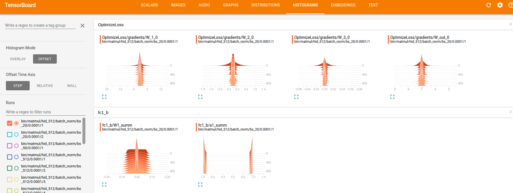

# tensorflow-xnor-bnn
BinaryNets in TensorFlow with XNOR GEMM op

### Dependencies
The project was tested with:
* `python 3.6.1`
* `tensorflow 1.2.1`
* `numpy 1.13.1`
* `g++ 4.8.4`
* `Cuda compilation tools, release 8.0, V8.0.44`

## Using this repo

### 1 - Compile the gemm_op.so library
1. Run `source setenv.sh` to set `TF_INC` variable with location to core tensorflow headers (you do not need to have source installed). 
2. In project root run `mkdir obj libs`, this is where `gemm_op.so` will be placed.
3. Run `make`. If you want to make changes to the op without changing the kernels, there is a `cpp` target to save time. 

### 2 - Confirm the op yields same results as tf.matmul()
* Run `python test_gemm_op.py` which generates two matrices of +1/-1 and compares the results from `xnor_gemm` to `tf.matmul`.

### 3 - Run benchmarks
* Run `python matmul_bench.py` to compare the GEMM performance between the `xnor_gemm` and `tf.matmul`. The speedup is less than that reported in https://arxiv.org/abs/1602.02830 because we're comparing to a highly optimized kernel, not the unoptimized base kernel. The results should be similar to the improvement over cuBLAS (2-3x for large matrices). Some results for three GPUs are reported below, where N is the size of square input matrices.

GTX-680-4GB

|N     | RUNS| Avg	(s)| Std	(s)| Avg (s) | Std	(s)| Speedup |
|------|:----|:--------|:--------|:--------|:--------|:-------:|
|1024	 |20	 |0.00608	 |0.00051	 |0.00875	 |0.01861	 |1.44     |
|2048	 |10	 |0.01877	 |0.00235	 |0.02770	 |0.02294	 |1.48     |
|4096	 |10	 |0.07897	 |0.00325	 |0.11908	 |0.02427	 |1.51     |
|8192	 |10	 |0.36292	 |0.00331	 |0.75703	 |0.02268	 |2.09     |

GTX-TITAN-BLACK-6GB

|N | RUNS	| Avg	(s) | Std	(s) | Avg (s)	| Std	(s) | Speedup |
|------|:----|:--------|:--------|:--------|:--------|:----:|
| 1024 | 20  | 0.00473 | 0.00021 | 0.00362 | 0.00199 | 0.76 |
| 2048 | 10  | 0.01184 | 0.00007 | 0.01364 | 0.00879 | 1.15 |
| 4096 | 10  | 0.04598 | 0.00524 | 0.06320 | 0.01995 | 1.37 |
| 8192 | 10  | 0.19189 | 0.00323 | 0.35513 | 0.08722 | 1.85 |

TESLA-P100-PCIE-12GB

| N    | RUNS | Avg (s) | Med (s)  | Avg (s) | Med (s) | Speedup (avg) | Speedup (med) |
|------|------|---------|----------|---------|---------|---------------|---------------|
| 1024 | 19   | 0.00316 | 0.00317  | 0.00264 | 0.00202 | 0.83          | 0.64          |
| 2048 | 9    | 0.00804 | 0.008029 | 0.01028 | 0.00698 | 1.28          | 0.87          |
| 4096 | 9    | 0.02665 | 0.02647  | 0.04669 | 0.03353 | 1.75          | 1.27          |
| 8192 | 9    | 0.10526 | 0.10534  | 0.23801 | 0.19075 | 2.26          | 1.81          |

### 4 - Train MNIST

```
usage: mnist_fc_bnn.py [-h] [--log_dir LOG_DIR] [--n_hidden N_HIDDEN]
                       [--reg REG] [--lr LR] [--batch_size BATCH_SIZE]
                       [--max_steps MAX_STEPS] [--eval_every_n EVAL_EVERY_N]
                       [--binary] [--xnor] [--batch_norm] [--debug]
                       data_dir

positional arguments:
  data_dir              directory for storing input data

optional arguments:
  -h, --help            show this help message and exit
  --log_dir LOG_DIR     root path for logging events and checkpointing
  --n_hidden N_HIDDEN   number of hidden units
  --reg REG             l1 regularization penalty
  --lr LR               learning rate
  --batch_size BATCH_SIZE
                        examples per mini-batch
  --max_steps MAX_STEPS
                        maximum training steps
  --eval_every_n EVAL_EVERY_N
                        validate model every n steps
  --binary              should weights and activations be constrained to -1,
                        +1
  --xnor                if binary flag is passed, determines if xnor_gemm cuda
                        kernel is used to accelerate training, otherwise no
                        effect
  --batch_norm          batch normalize activations
  --debug               run with tfdbg
```  

The training script has reasonable defaults. Running `python mnist_fc_bnn.py /path/to/download/mnist/` results in:
```
step 0, loss = 5.7175, test accuracy 0.1050 (243.8 ex/s)
step 100, loss = 2.0587, test accuracy 0.9217 (11449.2 ex/s)
step 200, loss = 1.6467, test accuracy 0.9433 (2106.6 ex/s)
step 300, loss = 1.1352, test accuracy 0.9470 (15324.5 ex/s)
step 400, loss = 1.0114, test accuracy 0.9551 (14653.6 ex/s)
step 500, loss = 0.8495, test accuracy 0.9578 (13741.0 ex/s)
step 600, loss = 0.6992, test accuracy 0.9586 (15455.5 ex/s)
step 700, loss = 0.6375, test accuracy 0.9578 (18959.0 ex/s)
step 800, loss = 0.5467, test accuracy 0.9522 (13496.9 ex/s)
step 900, loss = 0.5446, test accuracy 0.9602 (14288.7 ex/s)
Final test accuracy 0.9644
Avg ex/s = 9139.7
Med ex/s = 13472.4
```

Passing the `log_dir` argument will automatically create a unique subfolder with a name based on the provided arguments (if all arguments are the same, a simple counter is incremented). The training/test loss/accuracy scalars are logged as well as histograms of weights (real valued and quantized, activations, and gradients). 



This command will run a simulated binary net (weights +/- 1 but using tf.matmul) and log to `/scratch/user/logs/tf-bnn/bin/matmul/hid_1024/batch_norm/bs_1024/0.0/1`
```
python mnist_fc_bnn.py /path/to/mnist/ --log_dir /scratch/user/logs/tf-bnn --batch_size 1024 --n_hidden 1024 --reg 0 --batch_norm --lr 0.00001 --binary
Final test accuracy 0.9022
```

The following will run an equivalent full precision net and log to `/scratch/user/logs/tf-bnn/fp/hid_1024/bs_1024/0.0/1`, 
```
python mnist_fc_bnn.py /path/to/mnist/ --log_dir /scratch/user/logs/tf-bnn --batch_size 1024 --n_hidden 1024 --reg 0 --lr 0.00001
Final test accuracy 0.9765
```
Note that the accuracy drop of 7.43% due to quantization is less than reported in the original paper, but this was an arbitrary choice of hyperparameters that trains quickly. An excellent discussion on choosing hyperparameters for training BinaryNets can be found in `How to Train a Compact Binary Neural Network with High Accuracy? - Tang et al AAAI-17`. In general, we really shouldn't be using any L1/L2 regularization (`--reg 0`) as this causes instability and more frequent sign changes.

Some things to keep in mind with training speed benchmarks:
* - We only get a speedup in forward pass since backprop is done with full precision gradients.
* - The default `binary_net` configuration has 4 layers, but weights aren't quantized in the input/output layers given signficant evidence in the literature that this has a disproportionate adverse impact on accuracy. Thus, when we run a `--xnor` `--binary` net, we're actually only quantizing half of the layers in the network. The training speedup should increase with additional layers.

GTX-TITAN-BLACK-6GB

| batch_size | n_hidden | steps | Avg (ex/s) | Med (ex/s) | Avg (ex/s) | Med (ex/s) | Speedup (avg) | Speedup (med) |
|------------|----------|-------|------------|------------|------------|------------|---------------|---------------|
| 512        | 512      | 1000  | 59,468.4   | 61,277.0   | 79,116.0   | 82,863.2   | 0.75          | 0.74          |
| 1024       | 512      | 1000  | 63,060.3   | 64,415.5   | 73,987.8   | 76,055.5   | 0.85          | 0.85          |
| 2048       | 512      | 500   | 42,262.9   | 42,864.1   | 41,527.4   | 42,075.2   | 1.02          | 1.02          |
| 4096       | 512      | 500   | 16,255.7   | 16,579.1   | 13,750.4   | 13,866.2   | 1.18          | 1.20          |
| 8192       | 512      | 300   | 4,628.4    | 4,591.8    | 3,799.0    | 3,798.9    | 1.22          | 1.21          |


## Limitations
 - XNOR GEMM op currently only works for square matrices that are powers of 2, with smallest N being 512.
 - `tf.sign()` used for quantization is leaky and outputs 0 if the input is exactly 0. In practice this doesn't hurt accuracy too much. 

## Relevant links
- https://github.com/tensorflow/tensorflow/issues/1592
- https://www.tensorflow.org/extend/adding_an_op
